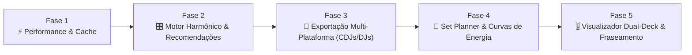

# 🗺️ AudioHarmonix — Plano Estratégico de Evolução e Roadmap de Recursos

> **Documento Oficial de Engenharia e Produto**  
> **Status**: Planejado / Em Fila de Execução  
> **Objetivo**: Elevar o AudioHarmonix ao padrão profissional definitivo de análise musical, suporte a palcos/CDJs e inteligência de mixagem para DJs e produtores.

---

## 🧭 Visão Geral das Etapas

---

## 📌 FASE 1: Otimização de Performance, Armazenamento & Cache Binário

### 🎯 Objetivo Principal
Garantir carregamento instantâneo ($< 5\text{ ms}$) de faixas já analisadas e reduzir o consumo de memória e disco através de serialização binária de alta eficiência.

### 📋 Metas e Tarefas a Cumprir
1. **Migração do Armazenamento de Waveform para BLOB Binário**:
   - [ ] Substituir a serialização de listas JSON de waveform no SQLite por empacotamento binário de floats (`struct.pack(f'{len(y)}f', *y)`).
   - [ ] Criar rotina de migração transparente para faixas já cadastradas em `audioharmonix.db`.
   - [ ] Implementar leitura direta em buffer binário no backend Python e envio otimizado para o frontend via typed arrays (`Float32Array`).
2. **Otimizações de Engine no SQLite**:
   - [ ] Ativar explicitamente modo `PRAGMA journal_mode=WAL` e `PRAGMA synchronous=NORMAL`.
   - [ ] Configurar `PRAGMA mmap_size=268435456` ($256\text{ MB}$) para leituras instantâneas sem overhead de I/O em disco.
3. **Validação de Performance**:
   - [ ] Medir latência de abertura da interface com biblioteca de 500+ faixas.

### 🏁 Critérios de Aceitação da Fase 1
* Redução de pelo menos $50\%$ no tamanho do banco de dados `audioharmonix.db`.
* Tempo de renderização da waveform na UI caindo para $0\text{ ms}$ perceptíveis.

---

## 📌 FASE 2: Motor de Transição Harmônica & Recomendador em Tempo Real (`HarmonicMixer`)

### 🎯 Objetivo Principal
Auxiliar o DJ na tomada de decisão rápida durante a performance, sugerindo automaticamente a próxima faixa compatível da biblioteca com base nas regras do Camelot Wheel e modulação de energia.

### 📋 Metas e Tarefas a Cumprir
1. **Implementação do Módulo `HarmonicMixer` no Backend**:
   - [ ] Criar classe `HarmonicMixer` em `crates/dsp_core/` encapsulando as regras harmônicas.
   - [ ] **Mix Harmônico Perfeito (Same Key / Relative)**:
     - Mesma chave ($8A \rightarrow 8A$) com compatibilidade $1.0$.
     - Chave Relativa ($8A \leftrightarrow 8B$) com compatibilidade $1.0$.
   - [ ] **Mix Suave (Subdominante / Dominante)**:
     - $+1$ ou $-1$ hora no relógio ($8A \rightarrow 9A$ ou $8A \rightarrow 7A$) com compatibilidade $0.9$.
   - [ ] **Energy Boost (+1 e +2 Camelot)**:
     - Transições para elevar a energia tonal da pista ($8A \rightarrow 10A$).
   - [ ] **Semitone Jump (+1 Semitom)**:
     - Modulação de impacto para clímax ($8A \rightarrow 3A$ — Lá menor para Si bemol menor).
   - [ ] **Diagonal Mix**:
     - Mudança de tom e modo simultâneos ($8A \rightarrow 9B$).
2. **Construção da API e Componente de Interface**:
   - [ ] Endpoint `/api/recommendations?key=8A&bpm=124&energy=7` retornando ranking de faixas da biblioteca.
   - [ ] Painel lateral na UI *"Smart Next Track"* com badges coloridas indicando o tipo de transição (*Harmonic, Energy Boost, Energy Drop*).

### 🏁 Critérios de Aceitação da Fase 2
* O DJ seleciona qualquer faixa no Deck e a UI exibe instantaneamente o Top 5 de faixas mais indicadas da biblioteca ordenadas por compatibilidade de tom e proximidade de BPM ($\pm 4\%$).

---

## 📌 FASE 3: Exportação Multi-Plataforma (Pioneer Rekordbox, Serato & Traktor)

### 🎯 Objetivo Principal
Permitir que os HotCues (1..8), BPM e tonalidades calculados pelo AudioHarmonix sejam exportados diretamente para os softwares de palco e pendrives de CDJ.

### 📋 Metas e Tarefas a Cumprir
1. **Módulo de Exportação Rekordbox (`.xml`)**:
   - [ ] Gerar arquivo XML com a especificação Pioneer Rekordbox `DJ_PLAYLISTS`.
   - [ ] Escrever nós `<COLLECTION>`, `<TEMPO>` e tags `<POSITION_MARK>` para cada HotCue identificado (`FIRST_BEAT`, `DROP_1`, `BREAK_1`, `BUILDUP`, `DROP_2`, `OUTRO`).
   - [ ] Mapear as cores oficiais de HotCue (Vermelho para Drop, Azul para Break, Amarelo para Buildup, Verde para Intro/Outro).
2. **Módulo de Exportação Serato DJ (`.crate` & ID3 GEOB)**:
   - [ ] Implementar escrita de tags ID3 `GEOB:Serato Markers2` para gravação direta dos 8 pads no arquivo MP3/FLAC.
   - [ ] Gerar arquivos `.crate` com ordenação por BPM e Camelot.
3. **Módulo de Exportação Traktor Pro (`.nml`)**:
   - [ ] Gerar arquivo de coleção NML com tags `<CUE_V2>` mapeando posições e tipos de HotCue.
4. **Interface de Exportação**:
   - [ ] Botão na UI: *"Exportar para Pendrive / Rekordbox XML"*, *"Exportar para Serato"* e *"Exportar para Traktor"*.

### 🏁 Critérios de Aceitação da Fase 3
* Importar o arquivo `.xml` gerado no Rekordbox e abrir no player da Pioneer com os 8 HotCues perfeitamente cravados nas batidas e nomeados corretamente.

---

## 📌 FASE 4: Planejador Inteligente de Sets & Curvas de Energia (Set Planner)

### 🎯 Objetivo Principal
Capacidade de ordenar e planejar um set de 1 a 3 horas de forma automatizada ou assistida, respeitando arcos narrativos de energia e continuidade harmônica.

### 📋 Metas e Tarefas a Cumprir
1. **Algoritmo de Otimização de Rota Harmônica**:
   - [ ] Implementar algoritmo de grafo para encontrar o caminho ótimo entre uma faixa inicial e final minimizando choques tonais e variações abruptas de BPM.
2. **Modelagem de Perfis de Curva de Energia**:
   - [ ] **Perfil Warm-Up $\rightarrow$ Peak $\rightarrow$ Reset**:
     - Início (Energia 3–5) $\rightarrow$ Meio (Energia 7–9) $\rightarrow$ Final (Energia 4–6).
   - [ ] **Perfil Festival Peak Time**:
     - Energia mantida constantemente entre 8 e 10 com modulações de $+1/+2$ Camelot.
   - [ ] **Perfil Continuous Deep / Hypnotic**:
     - Manutenção estrita de BPM e transições de mesma chave ($8A \leftrightarrow 8A / 8B$).
3. **Visualizador de Playlist na UI**:
   - [ ] Gráfico de linha interativo exibindo a curva de energia e a escada de BPM do setlist planejado.
   - [ ] Opção de arrastar faixas e ver o indicador de atrito harmônico em tempo real.

### 🏁 Critérios de Aceitação da Fase 4
* O usuário seleciona 25 músicas, escolhe o perfil *"Peak Time"*, e o sistema entrega o setlist ordenado com zero choques de tom e transições fluídas.

---

## 📌 FASE 5: Visualizador Avançado de Fraseamento e Transições (Dual-Deck Visualizer)

### 🎯 Objetivo Principal
Permitir a prática e o preview de transições antes da execução ao vivo, exibindo o encaixe de frases de 16/32 tempos entre duas músicas.

### 📋 Metas e Tarefas a Cumprir
1. **Alinhamento Visual de Formas de Onda (Deck A vs. Deck B)**:
   - [ ] Componente na UI que posiciona o `OUTRO` do Deck A sobreposto ao `INTRO / DROP_1` do Deck B.
   - [ ] Marcadores verticais de frases (linhas de 4 compassos / 16 beats).
2. **Contador Regressivo de Compassos (Phrase Countdown)**:
   - [ ] Exibição em tempo real: *"8 compassos restantes para o Drop do Deck B"*.
3. **Controle de Ganho e EQ Preview**:
   - [ ] Mini-mixer interativo de 3 bandas (Low / Mid / High) no player para testar a troca de baixos (*Bass Swap*) entre Deck A e Deck B.

### 🏁 Critérios de Aceitação da Fase 5
* O DJ consegue visualizar e ouvir a sobreposição das duas faixas perfeitamente sincronizadas antes de tocar ao vivo.

---

## 📊 Matriz de Prioridade e Impacto

| Fase | Recurso | Complexidade | Impacto para o Usuário | Prioridade |
|:---:|---|:---:|:---:|:---:|
| **Fase 1** | ⚡ Performance SQLite BLOB & Cache | Baixa | Alto (Velocidade) | 🔴 **P1 (Imediata)** |
| **Fase 2** | 🎛️ Motor Harmônico & Sugestões | Média | Altíssimo (UX DJ) | 🔴 **P1 (Imediata)** |
| **Fase 3** | 🚀 Exportador Rekordbox / Serato / Traktor | Média | Máximo (Padrão Indústria) | 🟡 **P2 (Curto Prazo)** |
| **Fase 4** | 📝 Set Planner & Curvas de Energia | Média-Alta | Alto (Planejamento) | 🟢 **P3 (Médio Prazo)** |
| **Fase 5** | 🎚️ Visualizador Dual-Deck & Fraseamento | Alta | Alto (Prática) | 🟢 **P3 (Médio Prazo)** |

---

## 📝 Registro de Decisões Técnicas

* **Decisão 1**: Manter a stack de detecção de tom no **KeyNet ONNX**, não importando o motor antigo de DSP do Paradox.
* **Decisão 2**: Preservar o frontend em **Tauri + Rust**, mantendo a aplicação com consumo ultrabaixo de recursos.
* **Decisão 3**: Adotar os formatos de exportação padrão de mercado (.xml Pioneer, .nml Traktor, .crate Serato) para interoperabilidade total.
